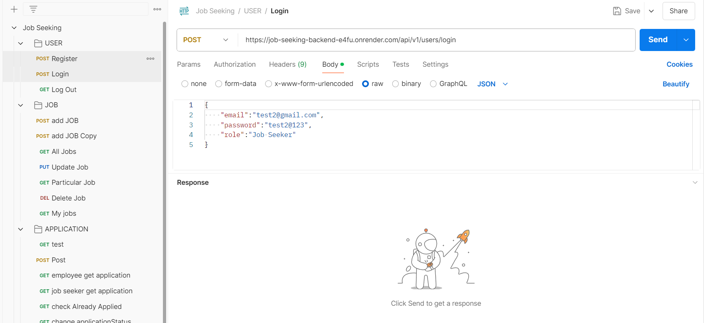

## Project Plan
### Error handling
- error handle middle ware
- error handler
- async error handler

### User model
{ name, email, password, role }
- user register✔
- user login✔
- logout✔
- getUser ✔
### Job model ✔
{
  "companyName": "Quantum Innovations",
  "companyMotto": "Pioneering Tomorrow",
  "aboutCompany": "Quantum Innovations is at the forefront of technological advancements, focusing on quantum computing and AI solutions. We are dedicated to pushing the boundaries of what's possible and making groundbreaking discoveries.",
  "employeeCount": 850,
  "location": "Boston, MA",
  "role": "Quantum Computing Researcher",
  "fixedSalary": 150000,
  "experience": 7,
  "job_description": "Join our team as a Quantum Computing Researcher, where you will explore and develop new quantum algorithms and systems. This role involves extensive research and collaboration with other experts in the field. A deep understanding of quantum mechanics and computational theories is essential.",
  "skill": "Quantum Mechanics, Python, Machine Learning, Research",
  "jobType": "Full Time",
  "jobMode": "Onsite"
}

- get all the jobs ✔
- post a new job ✔
- delete a job ✔
- update a particular job ✔
- get a particular job ✔
- get my jobs ✔

### Application Model
{
  
  "name": "Test2",
  "email": "test2@gmail.com",
  "contact": 9876543210,
  "gender": "Male",
  "currentLocation": "New York, NY",
  "yearOfGraduation": "2020",
  "experienceYear": 3,
  "skillSet":
  "whyYou": 
  userid, user type.(ref)
  employee, empoyee type (ref)
  companyDetail -> from job model
  status
} ✔

- testing ✔
- post an application ✔  + resume part ( cloudnary )
- get all application for a particular job - to be a employee  ✔
 (as an employee i can post multiple jobs , if i click on each job it will show me some   applications)
- get all application of particular user - to be done by user  ✔
- if applicant already registered ✔
- edit the application status by employee ✔

## Postman Requests:
